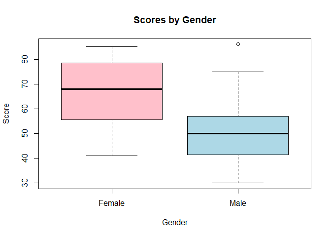

FA1\_KHAFAJI
================
Mostafa Khafaji
1 February 2024

## Question 1.

**Write the skewness program, and use it to calculate the skewness
coefficient of the four examination subjects in results.txt
(results.csv). What can you say about these data?**

Pearson has given an approximate formula for the skewness that is easier
to calculate than the exact formula given in Equation 2.1.

    ## Arch1: Person's Approx:  -0.6069042 , Actual Skew:  -0.5129462

    ## Prog1: Person's Approx:  -0.643229 , Actual Skew:  -0.3334265

    ## Arch2: Person's Approx:  0.5421286 , Actual Skew:  0.44816

    ## Prog2: Person's Approx:  -0.3562908 , Actual Skew:  -0.3018269

The value given by the formula is differentfrom the value given by the
function. However, the values are close enough that the difference
between them is almost negligible for descriptive purposes, but there
might be a problem when applying the/basing on the values on statistical
tests

## Question 2

For the class of 50 students of computing detailed in Exercise 1.1, use
R to

**(a) form the stem-and-leaf display for each gender, and discuss the
advantages of this representation compared to the traditional
histogram:**

    ## 
    ##   The decimal point is 1 digit(s) to the right of the |
    ## 
    ##   3 | 001257
    ##   4 | 11223448899
    ##   5 | 0111135666789
    ##   6 | 0445578
    ##   7 | 1555889
    ##   8 | 013356

As you would notice, the stem and leaf acts somewhat like a histogram
for the dataset, showing the count of data in each bin. However, unlike
the histogram, which completely groups that data into a bin, you can
still see the specific data in the stem and leaf graph. With this, you
can make more precise observations with the data.

**(b) construct a box-plot for each gender and discuss the findings.**

<!-- -->

The median score by females is much higher than the median score by
males.

The middle quartiles, i.e. from 25th to the 75th percentile, of males
are more dense than the middle quartiles of females.

The upper queartile of women are more dense than the upper quartile of
men.

The lower quartile of females overlap with the two middle quartiles of
the males.

The upper quartile of males overlap with the middle quartiles of
females.

The outlier in male scores is higher then the upper quartile of females.
